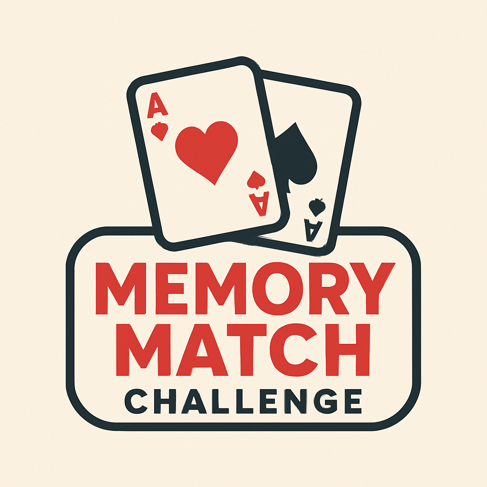

# memory-game
Memory Match Challenge

Theme: Playing cards

 (Chatgpt, 2025)

## Overview  
Memory Match Challenge is a classic memory card matching game themed around playing cards. The player is presented with a grid of face-down cards, aiming to find all matching pairs before time runs out. The game includes features such as a countdown timer, move counter, sound control, and clear win/loss messaging. This project was chosen to demonstrate interactive DOM manipulation and game logic in JavaScript, with a focus on beginner-friendly but complete functionality.

## User Stories  
- As a user, I want to see a landing screen with the game’s title and theme so that I know I’m in the right place.  
- As a user, I want clear instructions about how to play so I understand the rules before starting.  
- As a user, I want to see all cards face-down initially so I can start discovering pairs.  
- As a user, I want to click a card to flip it and reveal its symbol so I can find its match.  
- As a user, I want unmatched cards to flip back after a short delay so I have time to remember their positions.  
- As a user, I want matched cards to remain face-up so I can easily track progress.  
- As a user, I want to see my moves count so I can challenge myself to use fewer moves.  
- As a user, I want a countdown timer visible so I know how much time I have left to complete the game.  
- As a user, I want to hear background music and sound effects that I can toggle on and off.  
- As a user, I want to receive a clear win message when I find all pairs so I know the game is complete.  
- As a user, I want the option to restart or play again easily after finishing so I can try for a better score.

## Pseudocode  
// On page load:
// - Show title, theme, and instructions.
// - Wait for user to click Start Game button.

// On Start Game click:
// - Hide instructions and start button.
// - Shuffle card deck and render cards face-down.
// - Show a 3-2-1 countdown with cards briefly flipped face-up.
// - Flip all cards face-down when countdown ends.
// - Start countdown timer and enable card flipping.

// When a card is clicked:
// - If no card flipped, flip it and store as first selected card.
// - Else flip card and store as second selected card.
// - Lock board during comparison.
// - If the two selected cards match:
//   - Keep both cards face-up and update score.
//   - Check if all matches found to trigger win.
// - Else:
//   - After short delay, flip both cards face-down.
// - Increment move counter.
// - Reset first and second selected cards.

// If timer runs out before all matches found:
// - Display lose message.
// - Disable card flipping and show option to restart.

// On restart or play again button click:
// - Reset score, moves, and timer.
// - Shuffle and render cards.
// - Show countdown and resume gameplay.

text

## Getting Started  
The game is fully deployed and playable online at:  
[https://yousifalansari.github.io/memory-game/](https://yousifalansari.github.io/memory-game/)

### Prerequisites  
- Modern web browser with JavaScript enabled.

### How to Play  
Click "Start Game" on the landing page after reading instructions, then try to match all pairs of cards before the timer runs out. Use the sound toggle to mute/unmute audio. Track your moves and time left via the info panel. Win messages and restart options appear once the game ends.

### Planning Materials  
Class Canvas documents and personal pseudocode were utilized for this project’s structure and coding logic.

## Technologies Used  
- HTML5  
- CSS3 with Flexbox layout  
- JavaScript (ES6)  
- GitHub Pages for hosting

## Attributions  
This project was built inspired and guided by:  
- [GeeksforGeeks Memory Card Game Tutorial](https://www.geeksforgeeks.org/javascript/build-a-memory-card-game-using-html-css-and-javascript/)  
- [JavaScript Academy YouTube Tutorial](https://www.youtube.com/watch?v=xWdkt6KSirw&ab_channel=JavaScriptAcademy)  
- [Kenny Yip Coding YouTube Tutorial](https://www.youtube.com/watch?v=wz9jeI9M9hI&ab_channel=KennyYipCoding)  
- Course lectures and Canvas documents

## Next Steps  
- Add multiplayer mode with turns and scoring.  
- Improve accessibility with keyboard navigation and ARIA labels.  
- Add persistent leaderboard using localStorage or backend.  
- Implement difficulty levels with varying grid sizes and timers.  
- Enhance mobile responsiveness and design polish.  
- Add sound volume control and settings menu.